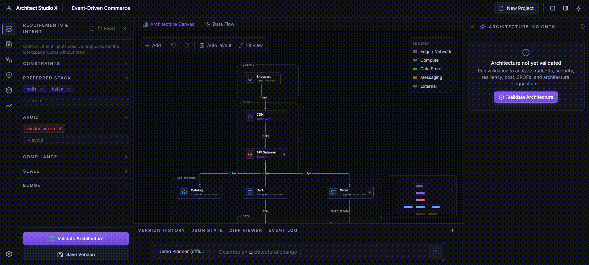
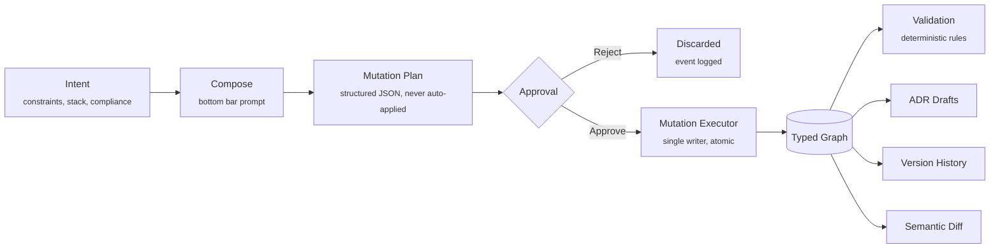

# Architect Studio X

A visual architecture workspace where you design systems on a canvas,
weigh tradeoffs, and evolve the design over time. The graph underneath
the canvas is typed, deterministic, and the source of truth, AI
proposes structured changes, a deterministic engine validates them, and
nothing touches the graph until you click **Approve**.



- **Visual-first.** The canvas is the product. Panels and JSON are
  projections of the graph.
- **Proposal-gated AI.** AI returns structured mutation plans; you
  review and approve before anything is applied.
- **Deterministic validation.** Ten posture checks run as pure
  functions over the graph, never an LLM call.
- **Local-first.** Runs entirely in your browser against an optional
  local proxy. Fully usable offline with no API key.

---

## Why it exists

Whiteboards and generic diagram tools lose structure the moment you
close them. Most "AI architecture" tools regenerate the whole picture
each time you ask for a change. Architect Studio X is the in-between:
the canvas is how you think, the typed graph is how the system reasons,
and every change, manual or AI-proposed, flows through one auditable
mutation executor.

Closer to "version control + structured editor for architecture" than
to either a whiteboard or a one-shot generator.

---

## Quickstart

Requirements: Node 20+ and npm 9+.

```bash
git clone https://github.com/Balchandar/Architect-Studio-X.git
cd Architect-Studio-X
npm install
npm run dev
```

The client runs on <http://localhost:5173> and the proxy on
<http://localhost:3001>. No API key is needed, the **Demo Planner**
runs entirely offline and exercises the full Plan → Review → Approve
loop.

---

## Core workflow

```
Intent → Compose → Review → Approve → Apply → Snapshot → Validate
```

1. **Sketch** services on the canvas, or load a starter template.
2. **Compose** a change request in the bottom bar
   (e.g. _"add observability"_).
3. The planner returns a structured mutation plan, never a diagram.
4. The approval modal shows the plan grouped by service, the
   deterministic impact, validation findings it resolves, and any new
   findings it would introduce.
5. **Approve** applies the plan atomically and writes a version
   snapshot. **Reject** discards it.
6. Run **Validate** any time to refresh the right-panel insights.

The canvas, the JSON view, the diff viewer, the ADR drafts, and the
event log are all projections of the typed graph.

---

## How the parts fit together



The mutation executor (`client/src/lib/graph/mutations.ts`) is the only
function in the codebase that produces a new graph from a previous one.
Manual edits, template loads, and AI plans all funnel through it.

---

## Feature summary

| Area       | Capability                                                                              |
| ---------- | --------------------------------------------------------------------------------------- |
| Canvas     | Typed Add menu, dagre auto-layout, undo/redo, fit view, node + edge inspectors          |
| Compose    | Bottom prompt bar with model selector; Enter to send, Shift+Enter for newline           |
| Planner    | Strict-JSON mutation plans; hallucinated IDs sanitized at parse time                    |
| Approval   | Plan grouped by service; deterministic impact, resolved + new findings, planner warnings |
| Validation | Ten posture-check rules; right panel idle until you click Validate                      |
| ADRs       | Drafts auto-generated from approved plans and from validation runs                      |
| Versioning | Auto-snapshot on approve; semantic diff grouped by service with theme chips             |
| History    | 50-deep undo / redo (positional drags excluded)                                         |
| Templates  | Five starters: Healthcare, Commerce, IDP, Fintech, AI Inference                         |
| Theme      | Dark default + light preview, persisted per browser                                     |
| Trust      | `Rule` and `AI` badges on every finding; AI never mutates the graph directly            |

---

## The approval gate

This is the central invariant of the project:

- AI providers return a **structured plan**, never a diagram.
- The plan is dry-run-applied against an in-memory copy of the graph;
  it can only be approved if the apply succeeds.
- Approve / reject / apply / mutate are all recorded as events with
  actor (`user` or `ai`).
- Manual edits go through the same mutation executor.

Plans the planner sanitizer drops automatically:

- Mutations that reference IDs not in the current graph (and not
  introduced earlier in the same plan).
- Mutations with unknown actions or malformed payloads.
- `add_service` mutations missing `name` or `type`.

Anything dropped is surfaced as a warning chip on the approval modal.

---

## Validation rules

Ten deterministic posture checks. Each rule is a pure function over the
graph; the AI is never called.

| Rule                         | Severity   | Concern     |
| ---------------------------- | ---------- | ----------- |
| `public-database-exposure`   | critical   | security    |
| `unencrypted-in-transit`     | critical   | security    |
| `payment-mtls`               | warning    | security    |
| `missing-encryption-at-rest` | warning    | security    |
| `single-region`              | warning    | reliability |
| `missing-observability`      | warning    | reliability |
| `database-spof`              | suggestion | reliability |
| `internet-facing-internal`   | warning    | security    |
| `missing-backup`             | suggestion | reliability |
| `missing-waf`                | suggestion | security    |

Rules live in `client/src/lib/validation/rules.ts`. Adding one is a
single pure function plus a registry entry, and a Vitest case to lock
the behavior in.

---

## AI providers

| Option                  | Channel                            | Server env vars                                       |
| ----------------------- | ---------------------------------- | ----------------------------------------------------- |
| Demo Planner (offline)  | Deterministic mock,  no network    | -                                                     |
| GPT                     | OpenAI-compatible `/chat`          | `OPENAI_API_KEY`, `OPENAI_BASE_URL?`                  |
| Claude                  | Routed through OpenRouter          | `OPENROUTER_API_KEY`, `OPENROUTER_BASE_URL?`          |
| Gemini                  | Routed through OpenRouter          | `OPENROUTER_API_KEY`, `OPENROUTER_BASE_URL?`          |
| Ollama (local)          | `/api/chat` against `OLLAMA_BASE_URL` | `OLLAMA_BASE_URL?` (default `http://localhost:11434`) |

Azure OpenAI and any other OpenAI-compatible gateway are available
under **Settings → Models → Advanced providers**.

API keys are read from the server's environment only, the client never
forwards keys to upstream providers. Values typed into Settings are
remembered in the browser as a personal reminder and never leave it.

If no credentials are configured for the selected channel, the server
returns `501 ai-provider-not-configured` and the client transparently
falls back to the offline Demo Planner.

---

## Repository layout

```
.
├── client/                React + TypeScript + Vite frontend
│   ├── src/
│   │   ├── components/    canvas, panels, compose bar, layout
│   │   ├── lib/
│   │   │   ├── ai/        provider abstraction, planner, mock
│   │   │   ├── graph/     mutation executor, layout, diff
│   │   │   └── validation/ rules + engine (pure functions)
│   │   ├── store/         Zustand stores; only graphStore writes to the graph
│   │   └── types/         graph, mutations, insights, intent, version, adr
│   └── vitest.config.ts
├── server/                Thin Express AI proxy (no application storage)
├── docs/screenshots/
└── .github/               CI, issue + PR templates
```

---

## Development

```bash
npm run dev         # client + server concurrently
npm run typecheck   # client + server tsc --noEmit
npm run build       # client (vite) + server (tsc)
npm run test -w client   # Vitest suite (mutations, rules, planner, diff)
```

CI runs typecheck → test → build on every push and PR
(`.github/workflows/ci.yml`).

### Configuring providers

```bash
export OPENAI_API_KEY=...
export OPENROUTER_API_KEY=...
export OLLAMA_BASE_URL=http://localhost:11434
# Optional advanced:
export AZURE_OPENAI_KEY=...   AZURE_OPENAI_BASE_URL=...
export CUSTOM_OPENAI_KEY=...  CUSTOM_OPENAI_BASE_URL=...
```

---

## Comparison

A short positioning table, workflow models, not vendor names.

|                  | Traditional diagram tools   | AI diagram generators       | Architect Studio X                                       |
| ---------------- | --------------------------- | --------------------------- | -------------------------------------------------------- |
| Primary artefact | Pixels / shapes             | Generated picture           | Typed graph                                              |
| AI role          | None                        | One-shot full generation    | Structured **mutation plans** over the existing graph    |
| AI authority     | -                           | Often direct                | Proposal-only; human approval required                   |
| Validation       | Manual                      | Manual or none              | Deterministic rule engine                                |
| Versioning       | Snapshot of pixels          | Re-prompts                  | Graph snapshots + semantic diff grouped by service       |
| Auditability     | Limited                     | Limited                     | Every plan / approval / mutation logged with actor       |

---

## Non-goals

- General-purpose drawing or whiteboarding.
- Autonomous agents that mutate state without approval.
- Replacing IaC, observability, deployment, or runtime systems.
- Real-time multi-user collaboration.
- Plugin marketplace or extension system.
- Enterprise governance, RBAC, SSO, or compliance tooling.

The project stays focused on architecture reasoning workflows. If
something looks like it pushes toward the list above, it probably
doesn't belong here.

---

## Current limitations

An honest read of what isn't there yet.

- Browser / localStorage persistence only. State survives reloads in
  the same browser profile but is not portable yet (an `.asx` directory
  format is sketched in `lib/persistence/workspace.ts`).
- No collaboration. Single user, single tab.
- No first-class import / export. The bottom-panel **JSON State** tab
  shows the raw workspace for inspection.
- Validation is ten posture checks. Domain-specific rules (data
  residency, latency budgets, dependency cycles) are not implemented.
- Cost estimate uses fixed multipliers per service type, heuristic,
  not pricing-aware.
- Light theme is a preview; some accent colors are tuned for dark mode.
- Server is a thin proxy: no background jobs, no scheduling, no queue.

---

## Contributing

Contributions are welcome, please read [`CONTRIBUTING.md`](./CONTRIBUTING.md)
first. The architectural rules are non-negotiable: the graph stays the
source of truth, validation stays deterministic, and AI proposals stay
gated by the approval modal.

- Bug reports: [`.github/ISSUE_TEMPLATE/bug_report.md`](./.github/ISSUE_TEMPLATE/bug_report.md)
- Feature requests: [`.github/ISSUE_TEMPLATE/feature_request.md`](./.github/ISSUE_TEMPLATE/feature_request.md)
- Security: see [`SECURITY.md`](./SECURITY.md)
- Conduct: see [`CODE_OF_CONDUCT.md`](./CODE_OF_CONDUCT.md)

---

## License

Apache License 2.0 — see [`LICENSE`](./LICENSE) and [`NOTICE`](./NOTICE).
